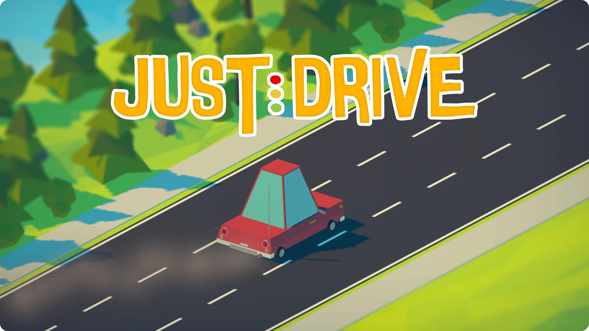

# Just Drive

**Just Drive** is an infinite runner where you drive a car down a hazard-filled street, dodging obstacles and collecting coins. Inspired by *Subway Surfers* and created as a learning project to explore procedural generation and mobile development in Unity.

> 🛠️ Built in 2018 using Unity  
> 🎮 Game page: [https://www.mikael.is/games/just-drive](https://www.mikael.is/games/just-drive)

## 🎮 About the Game

- Drive endlessly on a road filled with cars, barriers, and other hazards, collectings coins as you go.
- Environment and obstacles are procedurally generated to keep each run unique.
- Features simple controls and fast-paced gameplay.

## 📦 Download

You can download the latest build from the [Releases](https://github.com/MikaelAndriIngason/just-drive/releases) section of this repository.

## 📄 License

See [LICENSE.md](LICENSE.md)
